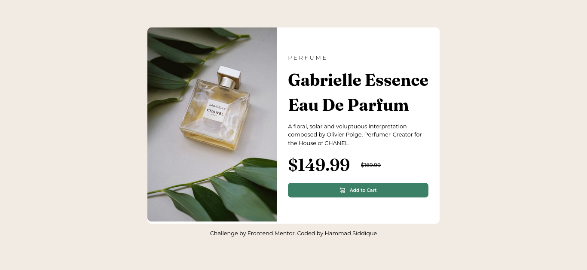
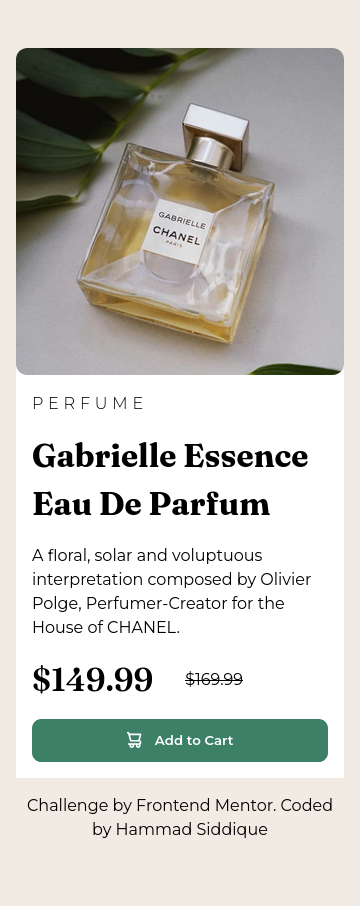

# 🛍️ Product Preview Card

A clean and responsive **Product Preview Card** built using HTML and CSS. This project focuses on layout structuring, responsive design, and modern UI styling.

---

## 🚀 Live Demo

🔗 https://product-preview-card-nine-zeta.vercel.app/

---

## 📸 Screenshots

### 💻 Desktop View

### 📱 Mobile View

---

## 🧠 What I Built

This project is a responsive product card component that includes:

- Product image using `<picture>` for responsiveness  
- Product details (title, description, pricing)  
- Styled call-to-action button  
- Clean typography using Google Fonts  
- Fully responsive layout (desktop → mobile)

---

## ⚙️ Tech Stack

- HTML5  
- CSS3 (Flexbox + Custom Properties)  
- Responsive Design (Media Queries)  

---

## 🎯 Features

- 📱 Mobile-first responsive design  
- 🎨 CSS variables for easy theming  
- 🖼️ Optimized images using `<picture>`  
- 🧩 Clean and reusable structure  
- ✨ Hover & active button effects  

---

---

## 📌 What I Learned

- How to use the `<picture>` element for responsive images  
- Better control over layouts using Flexbox  
- Using `clamp()` for responsive typography  
- Structuring reusable and clean CSS with variables  

---

## 🔧 Future Improvements

- Add accessibility improvements (ARIA labels, better alt text)  
- Improve button interaction (focus states)  
- Convert into a reusable component (React or Vue)

---

## 🙌 Acknowledgment

Challenge by Frontend Mentor.  
Coded by **Hammad Siddique**
